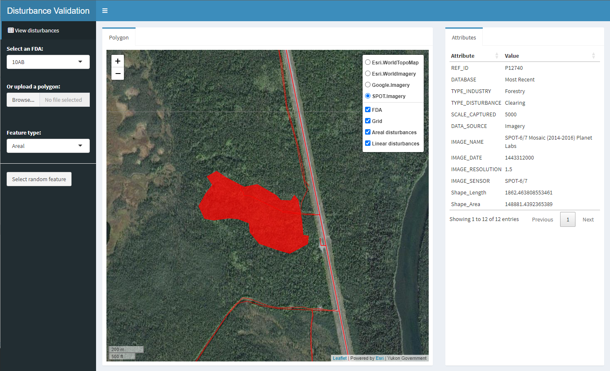

## Disturbance Validation

September 20, 2023

The purpose of the Disturbance Validation app is to enable users to interactively examine linear and areal surface disturbance features along with several satellite imagery sources. This permits alternative digitizers or other users to quickly look at the digitized features and their assigned attributes, and visually compare them to more than one high resolution imagery source. Three satellite images are available for viewing: Esri WorldImagery, Google Imagery, and SPOT Imagery for circa 2021. Currently, the app can only be used using the demo dataset for four partial or full watersheds in the southeast Yukon. A future release will enable users to upload their own linear and areal features and will include instructions on how to do so.

The app can be run from a local machine using the following steps:

  1. Install R (download from r-project.org and follow instructions)
  2. Install the following additional packages:

    install.packages(c("sf","DT","leaflet","tidyverse","shinydashboard","leaflet.esri"))

  3. Start the Shiny app:

    shiny::runGitHub("beaconsproject/disturbance_validation")

Functionality

Select an area of interest:
  - Select an existing fundamental drainage area (FDA)
  - Upload an area of interest (AOI) polygon as a geopackage (�.gpkg�)
  - If you upload an area of interest, the projection must be EPSG:3579 (NAD83(CSRS) / Yukon Albers). Moreover, in order to generate intactness and footprint maps, the uploaded polygon must overlay the data extent provided within the app.

Input data

Regional disturbance map

The key input data is the regional disturbance dataset. Currently, only open source file geopackages (�gpkg�) can be used. The demo dataset (fda_10ab.gpkg) consists of a fundamental drainage area (watershed) located in the Yukon. It includes the following layers. The fda_10ab.gpkg geopackage includes the following layers:
  - fda: watershed (fundamental drainage area) boundary
  - sd_line: linear anthropogenic features
  - sd_poly: areal (polygonal) anthropogenic features
  - nts_yt_9x9: 9 x 9 grids nested withing each 1:50,000 NTS grid

The sd_poly layer includes the following attributes:
  - REF_ID
  - TYPE_INDUSTRY
  - TYPE_DISTURBANCE
  - CREATED_BY
  - IMAGE_DATA
  - Area_ha

The sd_line layer includes the following attributes:
  - REF_ID
  - TYPE_INDUSTRY
  - TYPE_DISTURBANCE
  - CREATED_BY
  - IMAGE_DATA
  - Length_km
